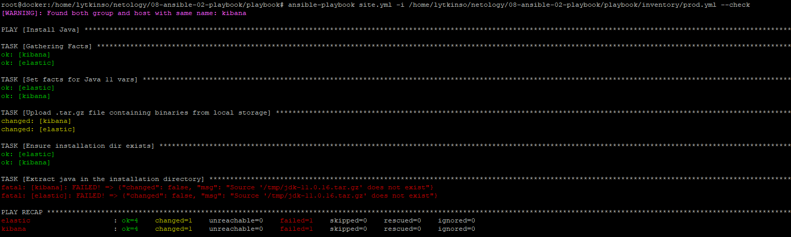
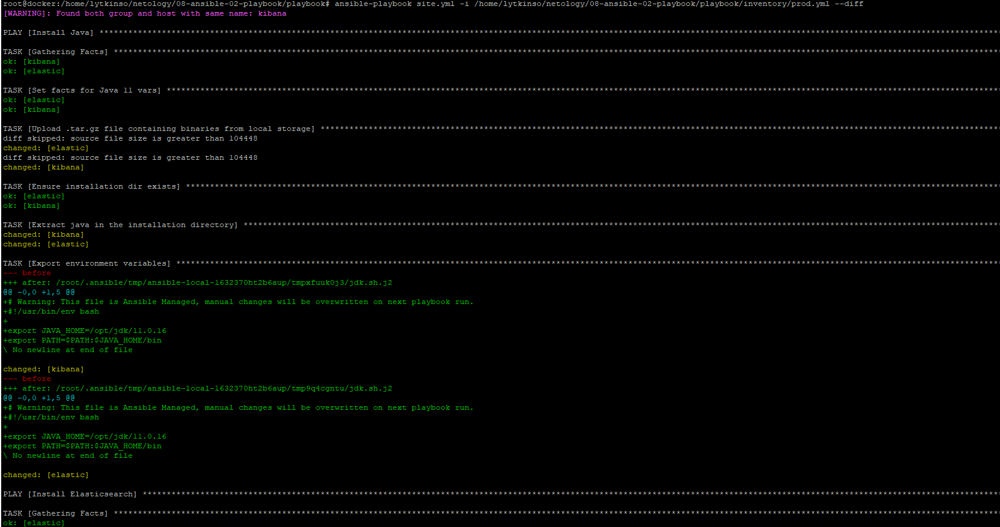

# devops-netology_8.2
1-6. 
  
7-8.
  
9. 
Group_var:
java_jdk_version - версия java
java_oracle_jdk_package - название пакета
elastic_version - версия elastic
elastic_home - название пакета
kibana_version - версия kibana
kibana_home - название пакета

Inventory: описаны два контейнера Docker (hosts elastic и hosts kibana)

Templates: 
elastic_home - домашний каталог
java_home - домашний каталог
kibana_home - домашний каталог

Tasks:
Install Java:  
- установка переменных  
- загрузка пакета tar.gz с локального репозитория
- проверка каталога
- извлечение пакета tar.gz java
- установка переменных
Тег java для отладки  

Install Elasticsearch:   
- загрузка пакета tar.gz из удаленного репозитория
- создание каталога
- извлечение пакета tar.gz elasticsearch
- установка переменных
Тег elastic для отладки  

Install Java:  
- загрузка пакета tar.gz из удаленного репозитория
- создание каталога
- извлечение пакета tar.gz kibana
- установка переменных
Тег kibana для отладки 
